
### **Overview**
This exercise aimed to perform a Man-in-the-Middle (MitM) attack using ARP poisoning, and capture HTTP traffic. 

Bonus: Bypass browser security warnings by creating and deploying a fake certificate.
### **Steps to Perform ARP Poisoning and MitM**
#### **1. Create ARP Poisoning Script**
By using scapy, I created the script arp\_poisoning.py

**Script Summary:**

- Target IP: 172.16.4.132
- Router IP: Determined dynamically or set to 172.16.4.2
- Spoofed MAC: Attacker's MAC address (00:0c:29:10:09:c3)
- Packets sent continuously to poison ARP caches of both target and router.
#### **2. Setup IP tables Rules**
- IP tablez rules were configured to redirect traffic to specific ports for processing:
- And it was made sure that HTTP requests sent to Kali do not end up in the preroute rule:

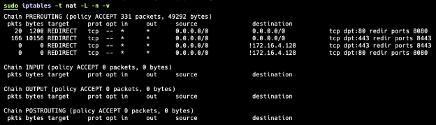

- Port forwarding enabled:

  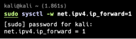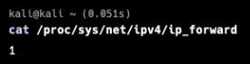

#### **3. Prepare Directories**
Created directories for storing logs and sniffed data:

sudo mkdir /tmp/sslsplit

sudo mkdir /home/kali/Documents/network\_security/Mandatory\_II/arp\_poisoning/sniff\_data

sudo mkdir /home/kali/Documents/network\_security/Mandatory\_II/arp\_poisoning/logs
#### **4. Run SSLsplit**
SSLsplit was used to intercept and log HTTPS traffic:

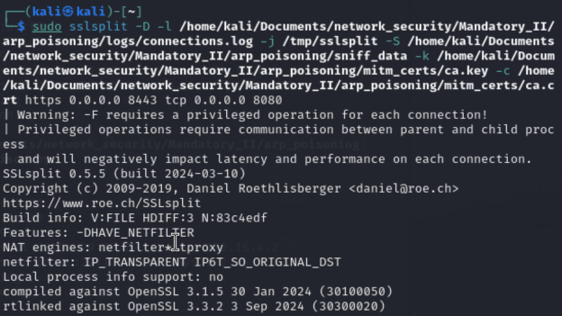
#### **5. Run arp\_poisoning.py script**
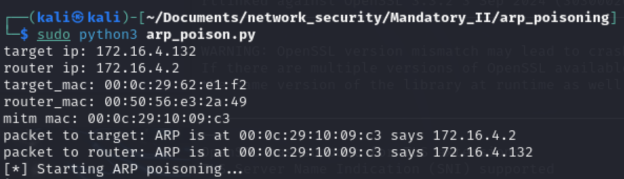

#### **6. Test Browser Behavior**
On the target machine:

- Visited kea.dk in Firefox.
- Observed a security warning regarding an untrusted certificate.
- Verified the certificate matched the one created.

Firefox gives an alert: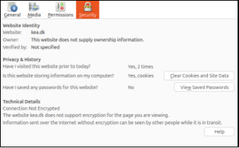

` `When the certificate is checked, it is the one I created:

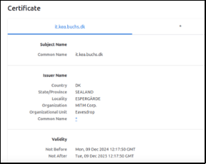

In the target machine, when **arp -a** is checked, default gateway has become kali linux:

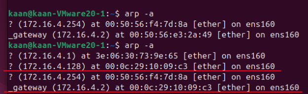

When I accept the security risk and continue, I can reach kea.dk but connection is not secure:

#### **7. Generate SSL Certificate**
A self-signed certificate was created for HTTPS interception:

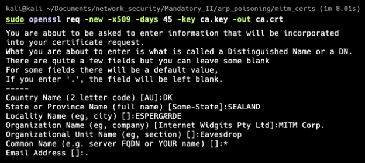

Certificate saved to: /home/kali/Documents/network\_security/Mandatory\_II/arp\_poisoning/mitm\_certs/

#### **8. Deploy Certificate to Target Machine**
To bypass the browser warning:

1. Transferred the certificate:

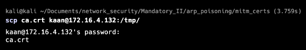

1. Installed the certificate as a trusted authority:

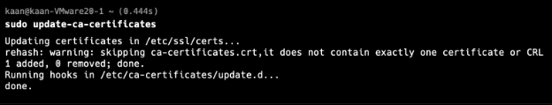

1. Converted to PEM format for Firefox:

1. Imported the certificate into Firefox:

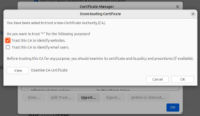
#### **8. Re-Test Browser Behavior**
After importing the PEM certificate into Firefox, I re-tested kea.dk. But this time arp spoofing did not succeed for reasons I couldn’t figure out. 

It could be that I have used the target machine to test other tools for System Security class exercises, in which I have installed tools like portsentry, squid and played around with iptables. I uninstalled these and tried again, but it still couldn’t spoof the ip. 
### **Conclusion**
- The setup was configured correctly, and it worked. But the browser could detect the spoofing.
- Fake certificate created and imported successfully. But this time, arp spoof didn’t work even though I tried different troubleshooting methods.

